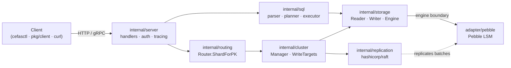
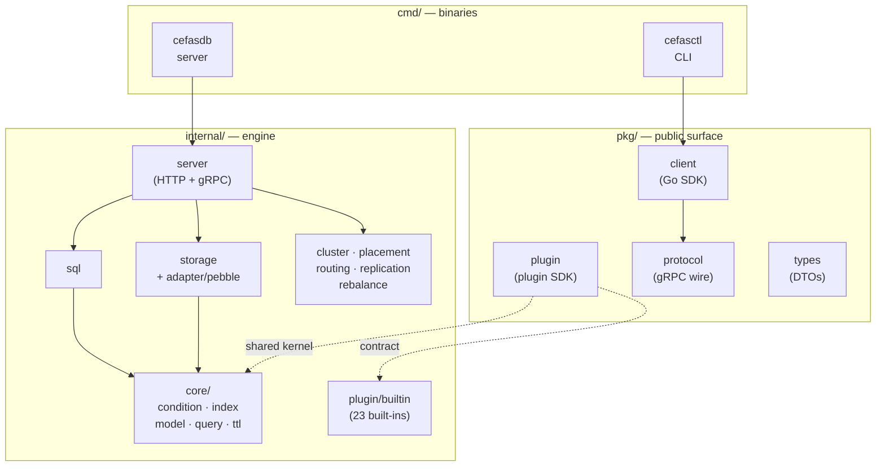
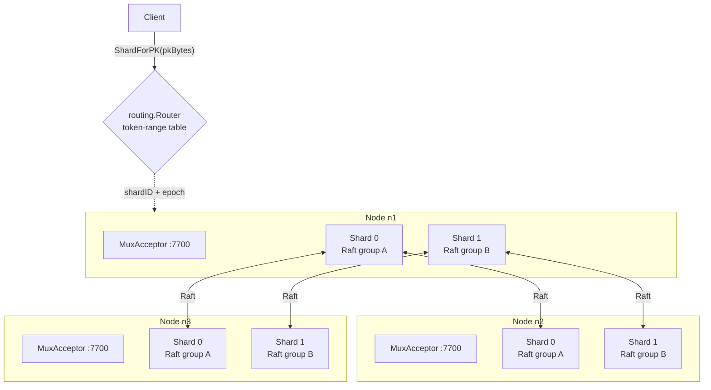

# CefasDB

> A high-performance NoSQL document store built for predictable
> millisecond-class access, horizontal scale, and a small operational
> footprint — with first-class support for plugins, vector search,
> multi-Raft replication, and DynamoDB-compatible wire shapes.

The repository ships two binaries:

| Binary | Purpose |
|---|---|
| `cefasdb` | The Go database server. Pebble-backed storage, HTTP/JSON and gRPC APIs, optional Raft multi-shard mode. |
| `cefasctl` | The CLI. Distributed as a prebuilt Go binary through npm under the command name `cefas`. |

Long-form documentation lives in the [GitHub Wiki](https://github.com/CefasDb/cefasdb/wiki):
[Get Started](https://github.com/CefasDb/cefasdb/wiki/Get-Started-Overview)
· [Concepts](https://github.com/CefasDb/cefasdb/wiki/Concepts-Overview)
· [Plugins](https://github.com/CefasDb/cefasdb/wiki/Plugins-Overview)
· [Interfaces](https://github.com/CefasDb/cefasdb/wiki/Interfaces-Overview)
· [Operations](https://github.com/CefasDb/cefasdb/wiki/Operations-Overview)

---

## What it does

`cefasdb` stores flexible documents behind a partition key and
optional sort key. On top of that it provides:

- **Item APIs.** `GetItem`, `PutItem`, `DeleteItem`, batch, atomic
  read-modify-write, conditional writes, TTL.
- **Query APIs.** Partition queries with sort-key ranges, GSI/LSI
  secondary indexes, spatial indexes (geohash + Z-order), ANN
  vector search.
- **SQL.** Server-side parser/planner/executor with EXPLAIN.
- **Streams.** DynamoDB-Streams-compatible change feed with
  retention.
- **Cluster.** Multi-Raft replication with placement, online
  split / range-move / drain / decommission, and an autonomous
  rebalancer.
- **Plugins.** Pluggable indexes (text, probabilistic, vector,
  spatial), distance operators, audience segments, and bandits.
- **Ops.** Backups with PITR, scheduled retention, Prometheus
  metrics, optional OTLP tracing, bearer-token authorization.

The item wire format is a compact typed JSON envelope: tags such
as `S` for strings, `N` for numbers, `BOOL`, `L` for lists, `M`
for maps, and `V` for native vectors.

---

## Architecture

A request flows from a client (`cefasctl`, the Go SDK, or any HTTP
or gRPC caller) through the server transport layer into the
planner, the partition router, and finally the Pebble-backed
engine. Multi-Raft replication is wired into the storage layer:
writes that go through `storage.Engine.PutItemWith` /
`DeleteItemWith` are routed through `internal/replication` when a
Raft cluster is attached.



---

## Package layout

Four public packages under `pkg/` (the contract third-party Go
code can `go get` and import). Everything else is `internal/`.



**Module path:** `github.com/CefasDb/cefasdb`

---

## Install the CLI

```sh
npm install -g @cefasdb/cefas
cefas --help
```

Node.js 18+ for the installer wrapper; the installed command is
the native Go CLI.

## Build locally

```sh
go build -o ./bin/cefasdb  ./cmd/cefasdb
go build -o ./bin/cefas    ./cmd/cefasctl

./bin/cefasdb \
  -data ./cefas-data \
  -http :8080 \
  -grpc :9090 \
  -grpc-reflection
```

In another shell, point the CLI at the local gRPC endpoint:

```sh
./bin/cefas --endpoint localhost:9090 --insecure list-tables
```

---

## First table

```sh
cefas --endpoint localhost:9090 --insecure create-table \
  --table-name Users \
  --attribute-definitions AttributeName=pk,AttributeType=S \
  --attribute-definitions AttributeName=sk,AttributeType=S \
  --key-schema AttributeName=pk,KeyType=HASH \
  --key-schema AttributeName=sk,KeyType=RANGE

cefas --endpoint localhost:9090 --insecure put-item \
  --table-name Users \
  --item '{"pk":{"S":"USER#1"},"sk":{"S":"PROFILE"},"name":{"S":"Ova"}}'

cefas --endpoint localhost:9090 --insecure get-item \
  --table-name Users \
  --key '{"pk":{"S":"USER#1"},"sk":{"S":"PROFILE"}}'

cefas --endpoint localhost:9090 --insecure query \
  --table-name Users --pk-value '{"S":"USER#1"}' --limit 25
```

---

## Cluster mode

A `cefasdb` cluster is a set of nodes that each host every shard's
Raft group. One TCP port per node multiplexes traffic for every
shard via `MuxAcceptor`; per-shard groups commit in parallel so
throughput scales horizontally. Routing is deterministic — the
`Router` resolves a partition key to a shard ID by xxhash → token
→ active placement range.



**Elasticity ops.** Online `split`, `range-move`, `move`,
`drain`, and `decommission`. Plans are returned dry-run first;
apply after review.

```sh
cefas cluster plan split        --shard 0 --min-voters 3
cefas cluster plan range-move   --source-shard 0 \
                                --range-start 0 \
                                --range-end 9223372036854775808 \
                                --min-voters 3
cefas cluster plan move         --shard 0 --source-node n1 --target-node n4 --min-voters 3
cefas cluster plan drain        --node n1 --min-voters 3
cefas cluster plan decommission --node n1

cefas cluster apply --plan file://split-plan.json --yes
cefas cluster split finalize --parent-shard 0 --child-shard 1 \
                              --expected-epoch 2 --writes-quiesced --yes
```

**Placement audit** runs online with bounded storage sampling:

```sh
curl -sS -X POST "$CEFAS_HTTP/v1/cluster/placement/audit" \
  -H "Authorization: Bearer $CEFAS_TOKEN" \
  -H "Content-Type: application/json" \
  -d '{"maxPrimaryKeysPerShard":4096,"maxIssues":200,"includeRepairPlan":true}'
```

**Autonomous rebalancer.** Opt-in via `rebalancer.enabled`.
Consumes hot-range metrics + placement state on a fixed interval
and proposes split / range-move / drain plans. Modes: `dry-run`
(log), `manual` (write plan files to `rebalancer.manualPlanDir`),
`auto` (apply safe plans directly).

---

## Vectors, ANN, PITR

Native vector attributes use the `V` tag with an optional
dimension marker; declare dimensions at table creation time to
make writes fail fast on mismatches:

```sh
cefas --endpoint localhost:9090 --insecure create-table \
  --table-name Documents \
  --attribute-definitions AttributeName=id,AttributeType=S \
  --attribute-definitions 'AttributeName=emb,AttributeType=V<3>' \
  --key-schema AttributeName=id,KeyType=HASH \
  --storage-class memory

cefas --endpoint localhost:9090 --insecure create-index \
  --table Documents --name emb_ann --type ann --field emb \
  --dim 3 --algorithm lsh --metric cosine

cefas --endpoint localhost:9090 --insecure top-k \
  --table Documents --by "ann(emb, :q)" --k 10 \
  --query '{"V":[0.1,0.2,0.3],"D":3}'
```

SQL can rank by the ANN index directly:

```sql
SELECT id FROM Documents ORDER BY emb ANN OF [0.1,0.2,0.3] LIMIT 10;
```

**Backups + PITR.** Backups record the storage change index at
checkpoint time. Restore can replay retained changelog entries up
to a target change index or timestamp:

```sh
cefas create-backup --backup-name nightly
cefas restore-table-from-backup \
  --backup-name nightly \
  --source-table-name Documents \
  --target-table-name Documents_recovered \
  --target-change-index 12345
cefas apply-backup-retention --keep-latest 7 --max-age 720h --dry-run
```

Scheduled backups can run from the server flags:

```sh
cefasdb \
  -backup-scheduler-enabled \
  -backup-scheduler-interval 1h \
  -backup-scheduler-name-template 'hourly-{{timestamp}}' \
  -backup-scheduler-retention-keep-latest 24
```

---

## Plugins

`pkg/plugin/` is the SDK third-party plugin authors implement
against:

- `IndexPlugin`, `AudiencePlugin`, `BanditPlugin`, `DistancePlugin`
- `Lifecycle` (Create / Describe / Rebuild / Drop) and `Descriptor`
- `testharness/` for plugin authors
- `distancecontract/` for distance-metric authors

`internal/plugin/builtin/` ships 23 implementations: similarity
metrics (`cosine`, `euclidean`, `manhattan`, `hamming`,
`haversine`, `jaccard`, `jarowinkler`, `levenshtein`, `damerau`),
sketches (`bloom`, `cbloom`, `cuckoo`, `cms`, `hll`, `minhash`,
`simhash`), structured indexes (`trigram`, `radix`, `roaring`,
`geohash`, `vectorlsh`), and the `audience` + `bandit` operators.

```sh
cefas list-plugins
cefas create-index --table Users --name user_name_trigram \
                   --type trigram --field name
```

---

## Run with Docker

The demo Compose stack runs `cefasdb` plus Prometheus and Grafana:

```sh
docker compose -f deploy/docker-compose.yml up --build
```

Ports: `8080` (HTTP + `/metrics`), `9090` (gRPC), `9091`
(Prometheus), `3000` (Grafana, default `admin` / `admin`).

A Helm chart for Kubernetes lives in `dist/helm/cefas`.

---

## Configuration

Precedence: **flags > `CEFAS_*` env vars > YAML file > defaults**.

Common server flags:

| Flag | Default | Purpose |
|---|---|---|
| `-data` | `./cefas-data` | Pebble data directory |
| `-http` | `:8080` | HTTP listen address |
| `-grpc` | empty | gRPC listen address (empty disables gRPC) |
| `-fsync` | `false` | Fsync on commit for stronger crash durability |
| `-config` | empty | YAML config file path |
| `-metrics-disabled` | `false` | Disable Prometheus metrics |
| `-tracing-endpoint` | empty | OTLP/gRPC collector endpoint |

Hot-range tracking lives under `metrics.*` (or `CEFAS_METRICS_*`)
with bounded Prometheus cardinality (`shard_count × 64` buckets).
Defaults can be overridden via `metrics.hotspot{Buckets,Window,
CoolingWindow,ReadThreshold,WriteThreshold,BytesThreshold,
LatencyThreshold,CompactionDebtThresholdBytes}`.

The CLI reads `~/.cefas/config.yaml`, `CEFAS_*` env vars, and
global flags (`--endpoint`, `--token`, `--token-file`, `--ca`,
`--insecure`, `--output`, `--timeout`).

---

## Repository layout

```text
cmd/                 binaries (cefasdb, cefasctl, cefas-loadtest)
deploy/              runtime: Dockerfile, docker-compose*, grafana/, prometheus/
dist/                publishable: helm/, npm/
internal/            engine implementation
  ├── server/        HTTP + gRPC handlers
  ├── sql/           parser, planner, executor
  ├── storage/       Reader / Writer / Engine boundary
  │   └── adapter/pebble/
  ├── core/          condition, index, model, query, query/mmr, stream, ttl
  ├── cluster/       Manager, orchestration
  ├── placement/     PlacementCatalog, plan strategies, audit
  ├── routing/       Router, tokens
  ├── replication/   hashicorp/raft glue
  ├── rebalance/     autonomous rebalancer
  ├── catalog/       table-descriptor adapter + domain
  ├── plugin/builtin/ 23 built-in plugin implementations
  ├── config/        config loader
  ├── compat/ddbjson/ DynamoDB-JSON wire adapter
  ├── metrics/       Prometheus
  ├── tracing/       OTLP
  ├── auth/          bearer-token authz
  └── bootstrap/     boot-time wiring
pkg/                 public Go API
  ├── client/        Go SDK
  ├── plugin/        plugin SDK + distancecontract + testharness
  ├── protocol/      gRPC wire (cefas.v1)
  └── types/         DTOs (TableDescriptor, Item, AttributeValue)
scripts/             admin/, bench/, gen/, loadtest/
third_party/         vendored deps
```

---

## Development

```sh
make ci             # vet + lint + test + coverage + sec
make test           # race + shuffle + coverage
make lint           # golangci-lint
make bench          # all benchmarks
make sec            # govulncheck + gosec + osv-scanner
```

Run the test suite with an isolated Go build cache when your
environment restricts the default cache directory:

```sh
GOCACHE=/tmp/cefas-gocache go test ./...
```

Releases are produced by GitHub Actions. The release workflow
builds the CLI, publishes GitHub Release assets, and publishes
the npm package from `dist/npm/`.

---

## License

See [`LICENSE`](LICENSE) for terms.
