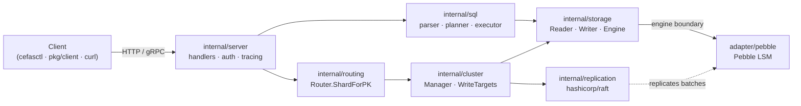

# CefasDB

CefasDB is a Pebble-backed NoSQL document store with HTTP/JSON and
gRPC interfaces, an optional Raft multi-shard mode, and a plugin
SDK third-party Go authors compile against. It targets teams that
need predictable millisecond-class reads on a few hundred GB to a
few TB of operational data, want a DynamoDB-compatible wire shape,
and can run the binary themselves on a small fleet of nodes. It
is not a general-purpose analytical engine, not a managed
service, and not a drop-in replacement for a relational database
with foreign-key enforcement.

The repository ships two binaries. `cefasdb` is the server: it
opens Pebble, loads the catalog, and serves HTTP/JSON and gRPC.
`cefasctl` is the Go CLI, distributed as a prebuilt binary
through npm under the command name `cefas`. Long-form
documentation lives in the
[GitHub Wiki](https://github.com/CefasDb/cefasdb/wiki):
[Get Started](https://github.com/CefasDb/cefasdb/wiki/Get-Started-Overview),
[Concepts](https://github.com/CefasDb/cefasdb/wiki/Concepts-Overview),
[Plugins](https://github.com/CefasDb/cefasdb/wiki/Plugins-Overview),
[Interfaces](https://github.com/CefasDb/cefasdb/wiki/Interfaces-Overview),
and [Operations](https://github.com/CefasDb/cefasdb/wiki/Operations-Overview).

## What CefasDB does

The data plane stores flexible documents behind a partition key
and optional sort key. Callers reach items through `GetItem`,
`PutItem`, `DeleteItem`, the batch APIs, and a server-side atomic
read-modify-write that lands every action of a transaction in a
single Pebble batch. Reads include partition queries with
sort-key ranges, secondary GSI/LSI indexes, geohash and Z-order
spatial indexes, and ANN top-K vector search over native `V`
attributes. The server hosts a SQL parser, planner, and executor
that consume the same engine surface; the planner emits an
`EXPLAIN` document operators can read before running a heavy
query. The item wire format is the typed DynamoDB-style JSON
envelope (`S` for strings, `N` for numbers, `BOOL`, `L` for
lists, `M` for maps, `V` for native vectors).

The cluster plane runs the server in a multi-Raft topology. Each
shard owns its own Raft group; one TCP port per node multiplexes
traffic for every shard through a `MuxAcceptor`, so per-shard
groups commit in parallel and throughput scales horizontally. A
deterministic router resolves a partition key to a shard ID
through xxhash and the active placement catalog. Operators drive
elasticity online — split, range-move, drain, decommission —
through a plan-first interface that returns a dry-run plan,
records voter selection deterministically against node capacity
and zone anti-affinity, and applies after explicit approval. An
opt-in autonomous rebalancer consumes hot-range metrics and
proposes balancing plans in `dry-run`, `manual`, or `auto` mode.

The operability plane covers backups with point-in-time restore,
scheduled retention with dry-run preview, Prometheus metrics
bounded at `shard_count × 64` hot-range buckets, optional OTLP
tracing on every handler, and bearer-token authorization with
per-scope checks. DynamoDB Streams compatibility delivers the
change feed with configurable retention.

## Architecture

A request enters through the transport layer in `internal/server`
(HTTP or gRPC, with auth and tracing already applied), passes
through the SQL planner when the verb is `ExecuteStatement` or
the routing layer when the verb is an item or query call, and
lands on the storage engine boundary declared in
`internal/storage`. The `Reader`/`Writer`/`Engine` interfaces sit
between the engine and the Pebble adapter at
`internal/storage/adapter/pebble`. When a Raft cluster is
attached, writes that flow through `storage.Engine.PutItemWith`
or `DeleteItemWith` are intercepted by the replicator and
committed through `internal/replication` before they land
locally; reads stay local.



## Install the CLI

The npm package downloads the matching prebuilt binary from
GitHub Releases. Node.js 18 or newer is required for the
installer wrapper; the installed command is the native Go binary.

```sh
npm install -g @cefasdb/cefas
cefas --help
```

## Build locally

```sh
go build -o ./bin/cefasdb  ./cmd/cefasdb
go build -o ./bin/cefas    ./cmd/cefasctl

./bin/cefasdb \
  -data ./cefas-data \
  -http :8080 \
  -grpc :9090 \
  -grpc-reflection
```

In another shell, point the CLI at the local gRPC endpoint:

```sh
./bin/cefas --endpoint localhost:9090 --insecure list-tables
```

## First table

```sh
cefas --endpoint localhost:9090 --insecure create-table \
  --table-name Users \
  --attribute-definitions AttributeName=pk,AttributeType=S \
  --attribute-definitions AttributeName=sk,AttributeType=S \
  --key-schema AttributeName=pk,KeyType=HASH \
  --key-schema AttributeName=sk,KeyType=RANGE

cefas --endpoint localhost:9090 --insecure put-item \
  --table-name Users \
  --item '{"pk":{"S":"USER#1"},"sk":{"S":"PROFILE"},"name":{"S":"Ova"}}'

cefas --endpoint localhost:9090 --insecure get-item \
  --table-name Users \
  --key '{"pk":{"S":"USER#1"},"sk":{"S":"PROFILE"}}'

cefas --endpoint localhost:9090 --insecure query \
  --table-name Users --pk-value '{"S":"USER#1"}' --limit 25
```

## Cluster mode

A `cefasdb` cluster places every shard's Raft group on every
node. The `routing.Router` resolves the partition key to a shard
ID against the active placement catalog; the `cluster.Manager`
holds the per-shard handles and the shared MuxAcceptor. The
elasticity surface returns a dry-run plan for split, range-move,
move, drain, and decommission, and applies only after explicit
approval. When `split` or `range-move` does not receive explicit
target voters, the planner selects active nodes deterministically
from node weight, CPU, memory, disk, tags, shard count, range
load, and zone anti-affinity. Draining and decommissioned nodes
are never selected as new targets.

```sh
cefas cluster plan split        --shard 0 --min-voters 3
cefas cluster plan range-move   --source-shard 0 \
                                --range-start 0 \
                                --range-end 9223372036854775808 \
                                --min-voters 3
cefas cluster plan move         --shard 0 --source-node n1 --target-node n4 --min-voters 3
cefas cluster plan drain        --node n1 --min-voters 3
cefas cluster plan decommission --node n1

cefas cluster apply --plan file://split-plan.json --yes
cefas cluster split finalize --parent-shard 0 --child-shard 1 \
                              --expected-epoch 2 --writes-quiesced --yes
```

Placement audit runs online with bounded storage sampling. It
reports token coverage gaps, overlapping active owners, primary
keys stored on the wrong shard, and primary rows whose shard is
missing the table catalog descriptor. The emitted `repairPlan` is
explicit and review-only; the audit endpoint does not apply
repairs.

```sh
curl -sS -X POST "$CEFAS_HTTP/v1/cluster/placement/audit" \
  -H "Authorization: Bearer $CEFAS_TOKEN" \
  -H "Content-Type: application/json" \
  -d '{"maxPrimaryKeysPerShard":4096,"maxIssues":200,"includeRepairPlan":true}'
```

The autonomous rebalancer is opt-in. When `rebalancer.enabled` is
true it consumes hot-range metrics and placement state on a fixed
interval and proposes split, range-move, or drain plans, enforcing
`rebalancer.maxConcurrentOperations` and `rebalancer.minInterval`.
`dry-run` logs decisions, `manual` writes plan files to
`rebalancer.manualPlanDir` for approval, and `auto` applies safe
plans directly.

## Vectors, ANN, and PITR

Native vector attributes use the `V` tag with an optional
dimension marker. Declaring dimensions at table creation time
makes writes fail fast on mismatches and lets the planner reason
about ANN feasibility.

```sh
cefas --endpoint localhost:9090 --insecure create-table \
  --table-name Documents \
  --attribute-definitions AttributeName=id,AttributeType=S \
  --attribute-definitions 'AttributeName=emb,AttributeType=V<3>' \
  --key-schema AttributeName=id,KeyType=HASH \
  --storage-class memory

cefas --endpoint localhost:9090 --insecure create-index \
  --table Documents --name emb_ann --type ann --field emb \
  --dim 3 --algorithm lsh --metric cosine

cefas --endpoint localhost:9090 --insecure top-k \
  --table Documents --by "ann(emb, :q)" --k 10 \
  --query '{"V":[0.1,0.2,0.3],"D":3}'
```

SQL can rank by the ANN index directly:

```sql
SELECT id FROM Documents ORDER BY emb ANN OF [0.1,0.2,0.3] LIMIT 10;
```

Backups capture the storage change index at checkpoint time.
Restore can replay retained changelog entries up to a target
change index or timestamp; a target before the backup high-water
mark or beyond retained history is rejected. Retention runs as a
dry-run first; when deletion cannot remove a checkpoint
directory the response reports `partialCleanup` and
`cleanupError` explicitly.

```sh
cefas create-backup --backup-name nightly
cefas restore-table-from-backup \
  --backup-name nightly \
  --source-table-name Documents \
  --target-table-name Documents_recovered \
  --target-change-index 12345
cefas apply-backup-retention --keep-latest 7 --max-age 720h --dry-run
```

The scheduler runs from server flags or the equivalent
`CEFAS_BACKUP_SCHEDULER_*` environment variables:

```sh
cefasdb \
  -backup-scheduler-enabled \
  -backup-scheduler-interval 1h \
  -backup-scheduler-name-template 'hourly-{{timestamp}}' \
  -backup-scheduler-retention-keep-latest 24
```

## Plugins

The plugin SDK at `pkg/plugin/` is the contract third-party
authors implement. It exposes `IndexPlugin`, `AudiencePlugin`,
`BanditPlugin`, and `DistancePlugin` interfaces; the `Lifecycle`
surface third-party indexes honour for Create, Describe, Rebuild,
and Drop verbs; the `Descriptor` shape every index uses; a
`testharness` package for plugin authors; and a
`distancecontract` package distance-metric authors compile
against. Built-in implementations live under
`internal/plugin/builtin/` and register themselves at startup
through the side-effect import
`internal/plugin/builtin/registry`. The 23 built-ins cover
similarity metrics (cosine, euclidean, manhattan, hamming,
haversine, jaccard, jaro-winkler, levenshtein, damerau),
probabilistic sketches (bloom, counting bloom, cuckoo, count-min,
HyperLogLog, MinHash, SimHash), structured indexes (trigram,
radix, roaring, geohash, vector LSH), and the higher-level
audience and bandit operators.

```sh
cefas list-plugins
cefas create-index --table Users --name user_name_trigram \
                   --type trigram --field name
```

## Run with Docker

The demo Compose stack runs `cefasdb` alongside Prometheus and
Grafana. The server exposes HTTP and `/metrics` on `:8080`, gRPC
on `:9090`; Prometheus runs on `:9091`; Grafana runs on `:3000`
with the default `admin` / `admin` login. A Helm chart for
Kubernetes lives in `dist/helm/cefas`.

```sh
docker compose -f deploy/docker-compose.yml up --build
```

## Configuration

The server reads its configuration from three sources with a
fixed precedence: command-line flags override `CEFAS_*`
environment variables, which override a YAML file, which
overrides built-in defaults. The CLI follows the same model and
additionally reads `~/.cefas/config.yaml`; global flags include
`--endpoint`, `--token`, `--token-file`, `--ca`, `--insecure`,
`--output`, and `--timeout`. Hot-range tracking lives under the
`metrics.*` keys (or the equivalent `CEFAS_METRICS_*` env vars)
and keeps Prometheus cardinality bounded at `shard_count × 64`
buckets; the overrides are
`metrics.hotspotBuckets`, `metrics.hotspotWindow`,
`metrics.hotspotCoolingWindow`, `metrics.hotspotReadThreshold`,
`metrics.hotspotWriteThreshold`, `metrics.hotspotBytesThreshold`,
`metrics.hotspotLatencyThreshold`, and
`metrics.hotspotCompactionDebtThresholdBytes`.

The most common server flags:

| Flag | Default | Purpose |
|---|---|---|
| `-data` | `./cefas-data` | Pebble data directory |
| `-http` | `:8080` | HTTP listen address |
| `-grpc` | empty | gRPC listen address (empty disables gRPC) |
| `-fsync` | `false` | Fsync on commit for stronger crash durability |
| `-config` | empty | YAML config file path |
| `-metrics-disabled` | `false` | Disable Prometheus metrics |
| `-tracing-endpoint` | empty | OTLP/gRPC collector endpoint |

## Repository layout

The Go module is `github.com/CefasDb/cefasdb`. The repository
splits into binaries, runtime assets, publishable artefacts, and
the engine itself. The two production binaries plus the load-test
driver live in `cmd/`. Runtime assets — the Dockerfile, the three
docker-compose layouts, and the Prometheus and Grafana
provisioning — live in `deploy/`. Publishable artefacts (the
Helm chart and the npm wrapper) live in `dist/`. The Go API
intended for third-party consumption lives in `pkg/`: the Go SDK
(`client`), the plugin SDK (`plugin`), the generated gRPC wire
contract (`protocol`), and the DTO vocabulary (`types`).
Everything else is engine implementation under `internal/`, which
hosts the HTTP and gRPC handlers (`server`), the SQL stack
(`sql`), the storage engine and its Pebble adapter (`storage`,
`storage/adapter/pebble`), the core domain kernel (`core`), the
cluster orchestration (`cluster`, `placement`, `routing`,
`replication`, `rebalance`), the catalog (`catalog`), the
built-in plugins (`plugin/builtin`), the config loader
(`config`), the DynamoDB-JSON wire adapter (`compat/ddbjson`),
the metrics and tracing wiring (`metrics`, `tracing`), the
bearer-token authorizer (`auth`), and the boot-time wiring
(`bootstrap`). Operator scripts live under `scripts/` in four
sub-folders: `admin/`, `bench/`, `gen/`, and `loadtest/`.
Vendored third-party code that ships under the cefas binary
lives in `third_party/`.

## Development

The `Makefile` is the single entry point for the local quality
gate. `make ci` runs vet, lint, the race-shuffled test suite with
coverage, the coverage threshold check, and the security
scanners; the underlying targets (`make vet`, `make lint`,
`make test`, `make cover`, `make sec`, `make bench`) are available
individually. When the local environment restricts the default Go
build cache, run the suite with an isolated cache directory
(`GOCACHE=/tmp/cefas-gocache go test ./...`). Releases are
produced by GitHub Actions: the release workflow builds the CLI,
publishes GitHub Release assets, and publishes the npm package
from `dist/npm/`.

## License

See [`LICENSE`](LICENSE) for terms.
