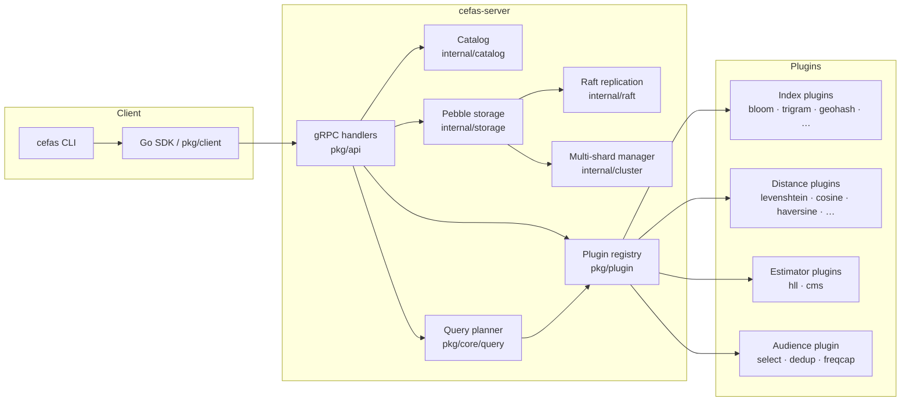
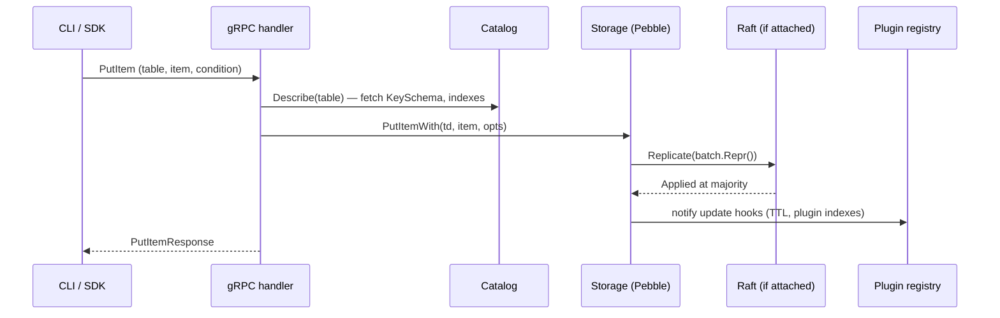
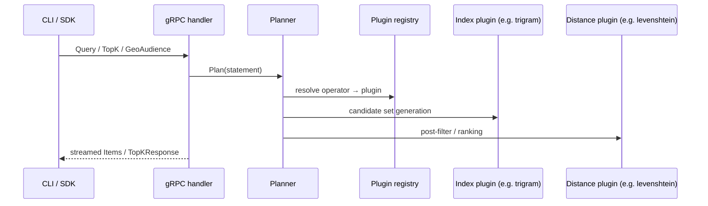

# Architecture overview

CEFAS is a DynamoDB-compatible key/value + document store with a
plugin-architected search and similarity surface. The engine is small
on purpose — specialized indexes, distance operators, approximate
counters, and audience workflows live as plugins behind a stable
boundary.

## Components



## Request lifecycle (write)



The same shape applies for `UpdateItem` (server translates an
UpdateExpression into a cefas SQL UPDATE then runs it through the
executor), `DeleteItem`, `BatchWriteItem`, and `TransactWriteItems`.

## Request lifecycle (read)



## Storage layout

Pebble holds every cefas namespace under a small set of prefixes:

| Prefix | Contents |
|---|---|
| `cefas/catalog/<table>` | Persisted `TableDescriptor` JSON. |
| `cefas/data/<table>/…` | Primary key/value rows. |
| `cefas/gsi/<table>/<index>/…` | Built-in GSI pointers. |
| `cefas/lsi/<table>/<index>/…` | Built-in LSI pointers. |
| `cefas/spatial/<table>/<index>/…` | Built-in geohash/Z-order pointers. |
| `cefas/ttl/<table>/<ttlAttr>/…` | TTL reaper bucket index. |
| `cefas/admin/backups/<name>` | Admin-named backup metadata. |

Plugin-backed indexes own their on-disk format. In v1 most of them
keep state in process memory; persistence via the
`pkg/core/ttl` + pebble-bucket seams is wired in follow-up work.

## Consensus + sharding

- Single-node mode: writes commit through the per-DB group-commit
  coalescer in `internal/storage/db.go`.
- Raft mode: a `Replicator` interface routes every write through
  `internal/raft/db.go`. Reads stay local.
- Multi-shard mode: `internal/cluster/manager.go` partitions tables
  by `pk_hash8` and replicates each shard with its own raft group.

## Plugin boundary

Plugins compile in via blank-imports in `pkg/plugin/builtins/`:

```go
import (
  _ "github.com/osvaldoandrade/cefas/pkg/plugin/bloom"
  _ "github.com/osvaldoandrade/cefas/pkg/plugin/trigram"
  // …
)
```

Each plugin's `init()` self-registers against `plugin.Default`. The
import-graph tests (`pkg/core/coregraph_test.go`,
`pkg/plugin/plugingraph_test.go`) guarantee plugins never reach back
into `internal/*` or engine packages — they only depend on
`pkg/core/*`. See [boundaries](boundaries.md) for the per-feature
classification.
