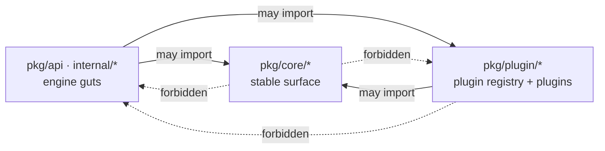

# Core vs plugin boundaries

CEFAS keeps the engine narrow. Specialized indexes, distance
operators, approximate counters, and audience workflows live as
plugins behind the `pkg/plugin` registry. The boundary is enforced
mechanically: `pkg/core/coregraph_test.go` and
`pkg/plugin/plugingraph_test.go` parse every file under their
respective trees and fail on any import that leaks across.

## Import-graph rule



Core has no knowledge of any concrete plugin. Plugins have no
knowledge of any engine internal. The two meet at `pkg/core` —
typed interfaces + data-only structs.

## Core

| Concept | Package |
|---|---|
| Table | `pkg/core/model` (aliases `pkg/types.TableDescriptor`) |
| Item | `pkg/core/model.Item` |
| Primary Key / Sort Key | `pkg/core/model.KeySchema` |
| Conditional Write | `pkg/core/condition.Evaluator` |
| TTL | `pkg/core/ttl.Service / Observer` |
| Streams / change events | `pkg/core/stream.ChangeStream` |
| Secondary Index lifecycle | `pkg/core/index.Lifecycle / Descriptor` |
| Query planner | `pkg/core/query.Planner` |
| Explain plan | `pkg/core/query.PlanNode / RenderExplain` |
| Top-K interface | `pkg/core/query.TopKEngine` |
| Distance operator interface | `pkg/core/query.DistanceOp / DistanceRegistry` |
| Plugin registry | `pkg/plugin.Registry` |
| Plugin lifecycle | `pkg/plugin.Lifecycle / Manager` |
| Plugin configuration schema | `pkg/plugin.Manifest` |
| Plugin health / status | `pkg/plugin.Status / StatusProvider` |
| Plugin-backed index routing | `pkg/plugin.IndexService` |

## Plugins

Each plugin lives under `pkg/plugin/<name>/`. Built-in plugins
register against `plugin.Default` via `init()` and are wired into the
server through `pkg/plugin/builtins`.

| Plugin | Kind | Package |
|---|---|---|
| Bloom Filter | Index | `pkg/plugin/bloom` |
| Counting Bloom Filter | Index | `pkg/plugin/cbloom` |
| Cuckoo Filter | Index | `pkg/plugin/cuckoo` |
| HyperLogLog | Estimator | `pkg/plugin/hll` |
| Count-Min Sketch | Estimator | `pkg/plugin/cms` |
| Roaring Bitmap | Index | `pkg/plugin/roaring` |
| Trie / Radix prefix | Index | `pkg/plugin/radix` |
| Trigram | Index | `pkg/plugin/trigram` |
| MinHash | Index | `pkg/plugin/minhash` |
| SimHash | Index | `pkg/plugin/simhash` |
| Vector LSH | Index | `pkg/plugin/vectorlsh` |
| Geohash | Index | `pkg/plugin/geohash` |
| Hamming | Distance | `pkg/plugin/hamming` |
| Levenshtein | Distance | `pkg/plugin/levenshtein` |
| Damerau-Levenshtein | Distance | `pkg/plugin/damerau` |
| Jaro-Winkler | Distance | `pkg/plugin/jarowinkler` |
| Jaccard | Distance | `pkg/plugin/jaccard` |
| Cosine | Distance | `pkg/plugin/cosine` |
| Euclidean | Distance | `pkg/plugin/euclidean` |
| Manhattan | Distance | `pkg/plugin/manhattan` |
| Haversine | Distance | `pkg/plugin/haversine` |
| Geo radius audience / dedup / freqcap / privacy aggregation / eligibility | Audience | `pkg/plugin/audience` |

The audience plugin combines geo radius selection, HLL-backed reach
estimation, TTL-bucketed dedup, sliding-window freqcap, server-side
aggregation with a privacy floor, and a composite eligibility
operator into one `AudiencePlugin` implementation. The Aggregate
function and Eligibility composer live next to it.

## Reading the boundary in code

Quick sanity check:

```bash
$ go test ./pkg/core/... -run CoreHasNoEngineImports
$ go test ./pkg/plugin/... -run PluginHasNoEngineImports
```

Both pass on every PR. They walk the source tree and fail on
forbidden imports — making it impossible to merge a change that
sneaks a coupling in.
