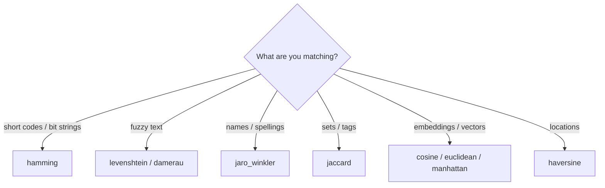

# Distance operator examples

Every shipped distance plugin returns a scalar where **smaller =
closer**. That convention lets thresholds compose uniformly (`op(x,
y) <= K`).

## Operator table

| Operator | Inputs | Returns | Typical pair |
|---|---|---|---|
| `hamming` | equal-length S or B | int (count of position-wise differences) | `simhash` index |
| `levenshtein` | S vs S | int (edit distance) | `trigram` index |
| `damerau` | S vs S | int (edit distance with adjacent transposition) | `trigram` index |
| `jaro_winkler` | S vs S | float in [0,1] (1 - similarity) | name matching |
| `jaccard` | SS or shingled S | float in [0,1] (1 - similarity) | `minhash` index |
| `cosine` | L of N or NS | float in [0,2] (1 - similarity) | `vectorlsh` index |
| `euclidean` | L of N or NS | float >= 0 (L2 distance) | `vectorlsh` index |
| `manhattan` | L of N or NS | float >= 0 (L1 distance) | `vectorlsh` index |
| `haversine` | M{lat,lon} | float >= 0 (meters) | `geohash` index |

## Query examples

```bash
# Levenshtein fuzzy match. The trigram index gets the candidate set;
# the levenshtein operator post-filters by exact distance.
cefas query \
  --table-name Merchants \
  --where "levenshtein(name, 'habibs') <= 2"

# Top-K by cosine similarity. vectorlsh narrows the candidate set;
# cosine ranks the survivors.
cefas top-k \
  --table Documents \
  --by "cosine(embedding, :query)" \
  --k 20 \
  --query '{"L":[ /* … 768-dim vector … */ ]}'

# Haversine inside a geo radius (delivered through the audience
# plugin, which already composes geohash + haversine).
cefas geo audience \
  --table Stores \
  --center "-23.9608,-46.3336" \
  --radius 1500m
```

## Test vectors

These are the canonical sanity inputs the per-plugin unit tests pin:

| Operator | Inputs | Expected |
|---|---|---|
| hamming  | `("karolin", "kathrin")` | 3 |
| levenshtein | `("kitten", "sitting")` | 3 |
| damerau | `("ab", "ba")` | 1 |
| jaro_winkler | `("MARTHA", "MARHTA")` | ≈ 0.961 similarity → 0.039 distance |
| jaccard | `({a,b}, {a,b,c})` | 1 − 2/3 |
| cosine | `((1,0), (1,0))` | 0 |
| cosine | `((1,0), (0,1))` | 1 |
| cosine | `((1,0,0), (-1,0,0))` | 2 |
| euclidean | `((0,0), (3,4))` | 5 |
| manhattan | `((0,0), (3,4))` | 7 |
| haversine | São Paulo → Santos | ≈ 55 km |

## Explain output

When a distance operator's planner integration arrives the explain
tree will surface the chosen index + post-filter explicitly. Today
the operator runs inline; the plan tree is synthetic (see
[index-plugin-examples](index-plugin-examples.md)).

## Choosing the right operator



For text matching at scale, always combine a search index plugin
(`trigram` / `minhash`) with the distance operator — the index
generates a small candidate set, the operator post-filters. Without
the index every query scans the table.
