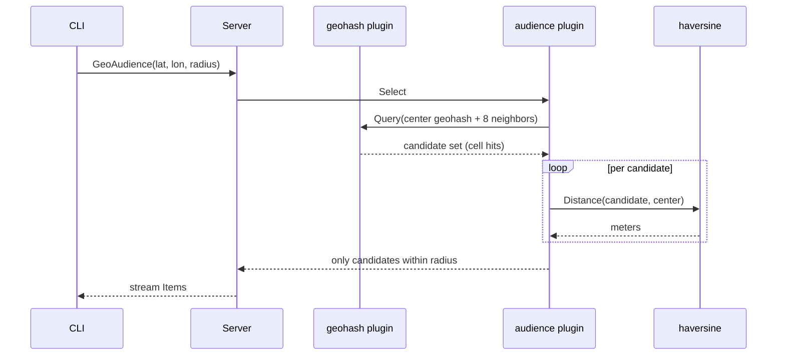

# Geo audience workflow

End-to-end walkthrough of a PicPay-Ads-style campaign: a PJ creates a
campaign, picks an audience by geography, delivers without spamming
the same user twice, caps per-merchant frequency, and reports
aggregated outcomes — all without exporting raw user identity.

## Setup

```bash
# 1. Create the store catalog table.
cefas create-table \
  --table-name Stores \
  --attribute-definitions AttributeName=id,AttributeType=S \
  --key-schema AttributeName=id,KeyType=HASH \
  --billing-mode PAY_PER_REQUEST

# 2. Seed a few merchants with {lat, lon} maps.
cefas put-item --table-name Stores --item '{
  "id":{"S":"s1"}, "loc":{"M":{"lat":{"N":"-23.5510"},"lon":{"N":"-46.6340"}}}
}'
cefas put-item --table-name Stores --item '{
  "id":{"S":"s2"}, "loc":{"M":{"lat":{"N":"-23.9608"},"lon":{"N":"-46.3336"}}}
}'

# 3. Create a geohash index — required by GeoAudience.
cefas create-index \
  --table Stores \
  --name loc_geo \
  --type geohash \
  --config '{"field":"loc","precision":7}'
```

## Audience selection

```bash
cefas geo audience \
  --table Stores \
  --index loc_geo \
  --center "-23.5505,-46.6333" \
  --radius 2000m
```

What the server does internally:



`geohash` produces false positives at hash-cell edges; `haversine`
post-filters them out so the response is the exact set inside the
radius.

## Approximate reach

```bash
cefas cohort estimate \
  --table Stores \
  --field id
```

Streams the matched store ids into a HyperLogLog sketch and returns
the approximate distinct count. Standard error ≈ 0.8% at precision 14.

## Dedup + frequency cap per delivery

```bash
# Before delivering: dedup (7-day TTL per campaign).
cefas dedup put \
  --scope campaign-123 \
  --key USER#1 \
  --ttl 168h
# Allowed: true   → proceed
# Allowed: false  → skip, already delivered this campaign to this user

# Cap deliveries per merchant per user per week.
cefas freqcap check \
  --scope merchant-456 \
  --key USER#1 \
  --limit 3 \
  --window 168h
# Allowed: true   → counts the hit and proceeds
# Allowed: false  → at the cap, do not deliver
```

State is in-memory in v1; persistent TTL-bucketed pebble storage is
the obvious follow-up.

## Aggregated reporting

```bash
cefas aggregate \
  --table CampaignEvents \
  --group-by campaign_id,geohash5 \
  --metrics impressions,clicks,redemptions \
  --min-group-size 100
```

`--min-group-size` is the privacy floor — see
[ads-privacy](ads-privacy.md). If any group falls below the floor the
server returns `FailedPrecondition` and the CLI exits non-zero with a
diagnostic. The response never contains partial / small-group rows.

## Explain plan

```bash
cefas explain --table Stores --where "haversine(loc, :c) <= 1500"
```

(See [distance-examples](distance-examples.md) for the canonical
output.)
